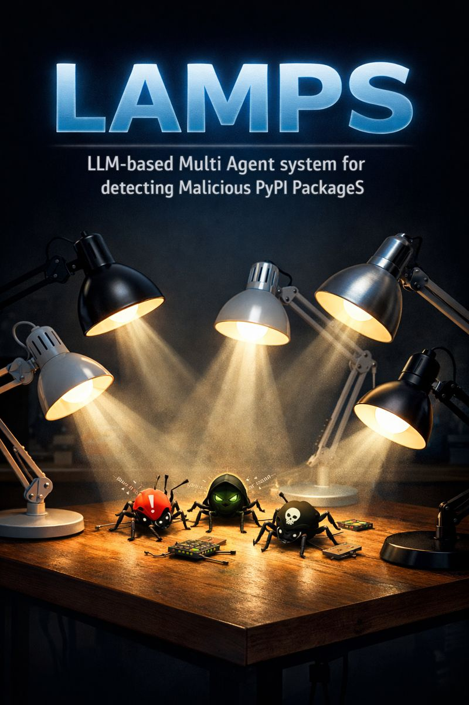

<p align="center">
  
</p>

# LAMPS — An LLM-based multi-agent system for detecting malicious PyPI packages

Reproduction package for *"Many hands make light work: An LLM-based multi-agent
system for detecting malicious PyPI packages"* (Zeshan et al., JSS 2026).

LAMPS coordinates four role-specialised agents through CrewAI:

| Agent | Backend | Responsibility |
|---|---|---|
| Fetcher | LLaMA-3 / Gemini Flash | Resolve PyPI metadata and download the source archive |
| Extractor | LLaMA-3 / Gemini Flash | Unpack the archive and select the relevant `.py` files |
| Classifier | Fine-tuned CodeBERT | Per-file binary malicious / benign decision |
| Verdict | LLaMA-3 / Gemini Flash | Conservative package-level aggregation + rationale |

## Repository layout

```
src/lamps/                       Modular Python package
├── agents/                      4 LAMPS agents (fetcher / extractor / classifier / verdict)
├── data/                        D1 / D2 dataset preparation
├── evaluation/                  Metrics
├── llms/                        Gemini wrapper (used by reasoning agents)
├── models/                      CodeBERT inference wrapper
├── pipeline.py                  End-to-end LAMPS pipeline
└── config.py                    Centralised paths and hyperparameters

experiments/
├── train_codebert.py            Fine-tune CodeBERT on D1
├── evaluate_d1.py               Evaluate LAMPS on D1 (setup.py)
└── evaluate_d2.py               Evaluate LAMPS on D2 (multi-file packages)

models/codebert-malware-detector/
├── code/                        Original training script (run.py, model.py)
└── data/                        Training JSONL files (populated by prepare_d1.py)

scripts/                         Orchestration scripts
Dataset/D1-6000snippets.csv      Bundled D1 raw data (6000 setup.py)
hybrid_pypi_classifier.py        Single-package CLI demo (live mode)
```

## Setup

```bash
pip install -e .
pip install -r requirements.txt
```

Set credentials for the reasoning agents (Verdict rationale generation only):

```powershell
$env:GEMINI_API_KEY = "<your-api-key>"
# Or, with Vertex AI:
gcloud auth application-default login
$env:GOOGLE_GENAI_USE_VERTEXAI = "True"
$env:GOOGLE_CLOUD_PROJECT = "<your-project-id>"
```

The Verdict Agent runs without an LLM by default and produces a deterministic
rationale; pass `--explain` to enable Gemini-generated explanations.

## Reproduce the experiments

### D1 — 6000 balanced setup.py files (paper §5.1)

```powershell
# 1. Prepare splits (package-level, 80/10/10)
python -m lamps.data.prepare_d1

# 2. Fine-tune CodeBERT (paper hyperparameters: lr=2e-5, batch=16, 4 epochs)
python -m experiments.train_codebert

# 3. Evaluate LAMPS end-to-end on the held-out test split
python -m experiments.evaluate_d1
```

Or run all three steps in one shot:

```powershell
.\scripts\run_full_pipeline.ps1   # PowerShell
bash scripts/run_full_pipeline.sh # Bash
```

Outputs are written to `results/d1/`:

* `report.txt` / `report.json` — accuracy, precision, recall, F1, balanced accuracy.
* `predictions.jsonl` — per-package decisions and rationales.

### D2 — 1296 multi-file packages (paper §5.2 / §5.3)

The raw D2 archive is **not redistributable**
("The authors do not have permission to share data."). Once obtained from
Ibiyo et al. (2025), drop it under `data/d2/raw/` following the layout
described in `src/lamps/data/prepare_d2.py`, then run:

```powershell
python -m lamps.data.prepare_d2
python -m experiments.evaluate_d2
```

`results/d2/` will contain both file-level and package-level reports and
predictions.

### Live demo on a single PyPI package

```powershell
python hybrid_pypi_classifier.py --package requests
python hybrid_pypi_classifier.py --package requests --version 2.31.0 --explain
python hybrid_pypi_classifier.py --package requests --json
```

This fetches the source archive from PyPI, extracts every Python file,
classifies them, and prints the conservative package-level verdict.

## Citation

```bibtex
@article{UMARZESHAN2026112792,
  title   = {Many hands make light work: An LLM-based multi-agent system for detecting malicious PyPI packages},
  journal = {Journal of Systems and Software},
  volume  = {236},
  pages   = {112792},
  year    = {2026},
  doi     = {10.1016/j.jss.2026.112792},
  url     = {https://www.sciencedirect.com/science/article/pii/S0164121226000269},
  author  = {Muhammad Umar Zeshan and Motunrayo Ibiyo and Claudio {Di Sipio} and Phuong T. Nguyen and Davide {Di Ruscio}}
}
```
